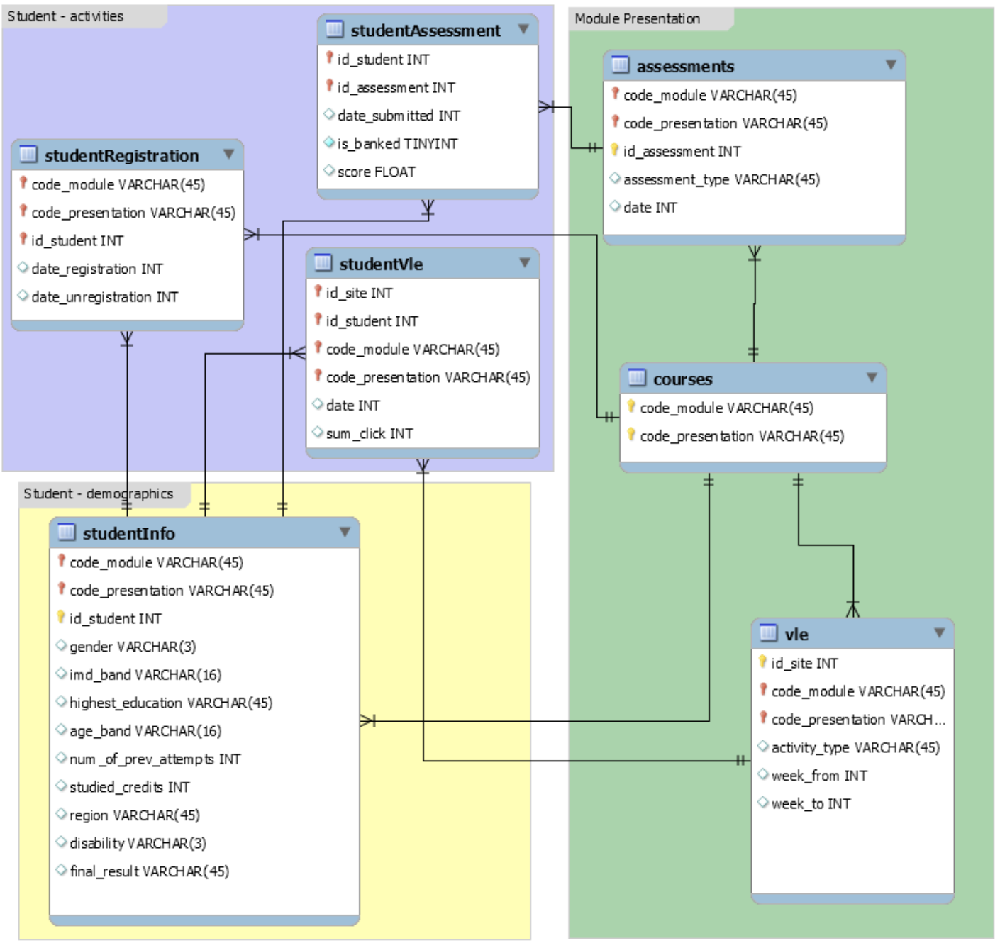

 

# EquitableEdu AI: Autonomous Student Analysis & Adaptive Learning Platform

   
   
   
   
  

--- 

## Overview 

This repository contains a comprehensive enterprise-grade application stack powered by a **Django Server**, styled with **TailwindCSS**, and supercharged with state-of-the-art machine learning, deep learning, and scientific computing libraries (`Scikit-learn`, `XGBoost`, `Pandas`, `NumPy`, `SciPy`, `Chart.js`). The platform is designed to tackle advanced hackathon and open innovation challenges spanning education, language access, and personalized learning. 

---

## <i class="bi bi-image-fill"></i> Architecture & Dashboard Preview

	

---

## Chosen Datasets for Analysis 

The following datasets have been selected as the primary sources for training, validation, and testing across our defined problem statements, chosen for their diversity in domain complexity and structure. ### Student Demographics and Learning Analytics Dataset (OULAD) 

* **Source:** anlgrbz/student-demographics-online-education-dataoulad 
* **Application:** Serves as the backbone for student risk classification, engagement pattern analysis, and unsupervised clustering workflows. * It provides the structured demographic variables and virtual learning environment telemetry required to train robust models capable of identifying academic regression early. 

--- 

## Technology Stack & Architecture 

* ** Backend:** Django Server (Python) * ** Frontend / UI:** TailwindCSS, HTML5, Responsive Layouts, Chart.js 
* ** AI & LLM Orchestration:** Ollama API (`OLLAMA_BASE_URL`, `OLLAMA_API_KEY`) 
* ** Machine Learning & Boosting:** Scikit-learn, XGBoost, LightGBM 
* ** Numerical & Scientific Computing:** NumPy, Pandas, SciPy * ** Data Visualization:** Matplotlib, Chart.js 

--- 

## Problem Statements Addressed 

### Problem Statement Set – 2 (AI for Equitable Education Access) 

Focuses on education, language access, and personalized learning. It addresses the systemic challenge where many students lack access to quality tutoring, doubt resolution, or personalized feedback because no system connects a student's specific confusion to the right explanation, at the right level, in the right language. Teachers in under-resourced schools are similarly stretched, often without a way to identify which students are falling behind until it is too late. 

1. ** Grounded Doubt-Solving Agent & Adaptive Practice Generator:** Explains concepts step by step from open textbooks with source citations and creates practice questions tailored to a student's demonstrated gaps. 
2. ** Teacher-Facing Insight Agent:** Flags students needing attention based on quiz and engagement patterns to enable proactive academic interventions.
3. ** Scholarship or Eligibility Matcher & Open Innovation:** Helps students discover and apply for aid they qualify for, supported by a flexible architecture capable of ingesting arbitrary educational datasets and delivering model-driven outputs.